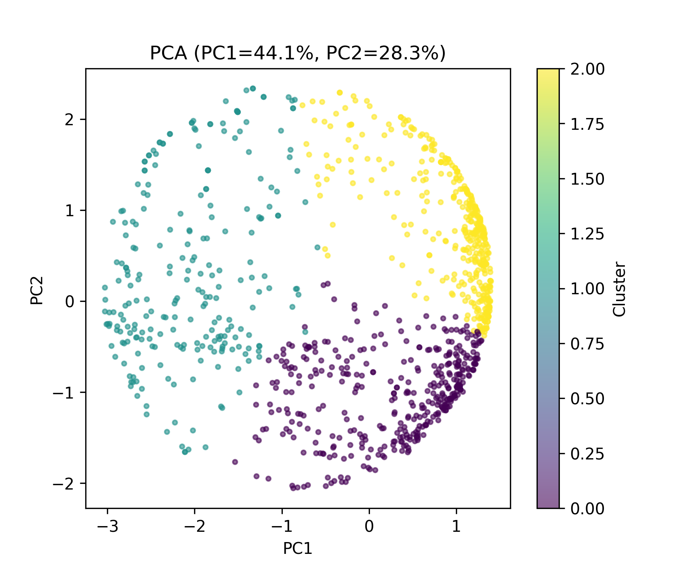
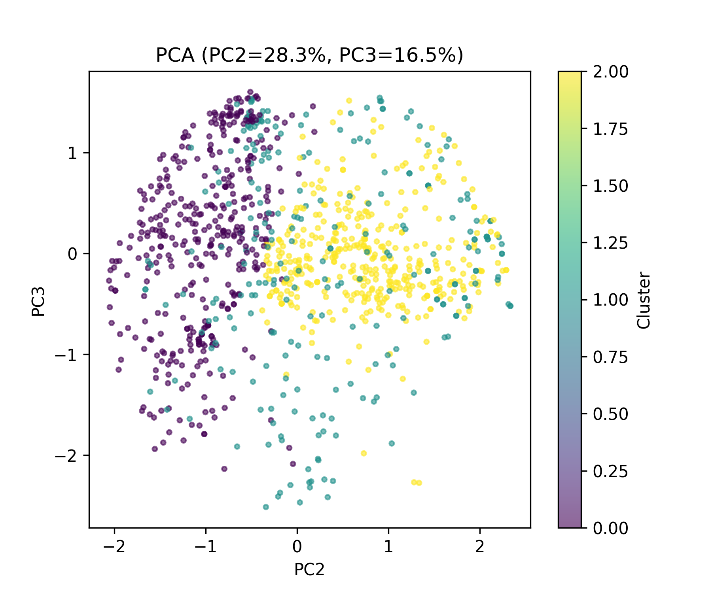
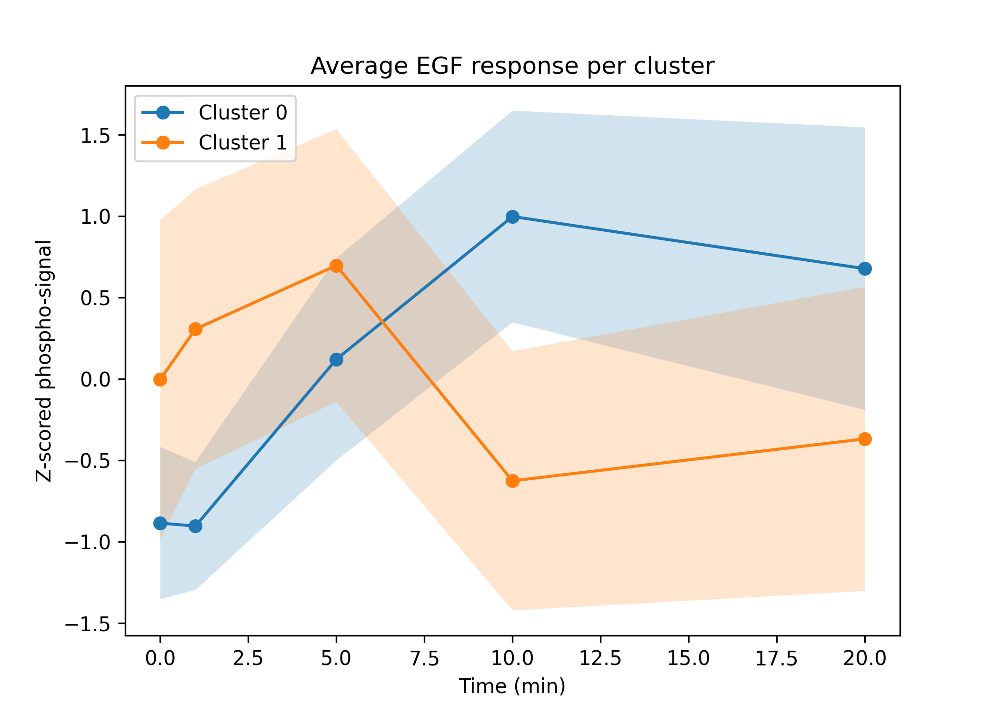
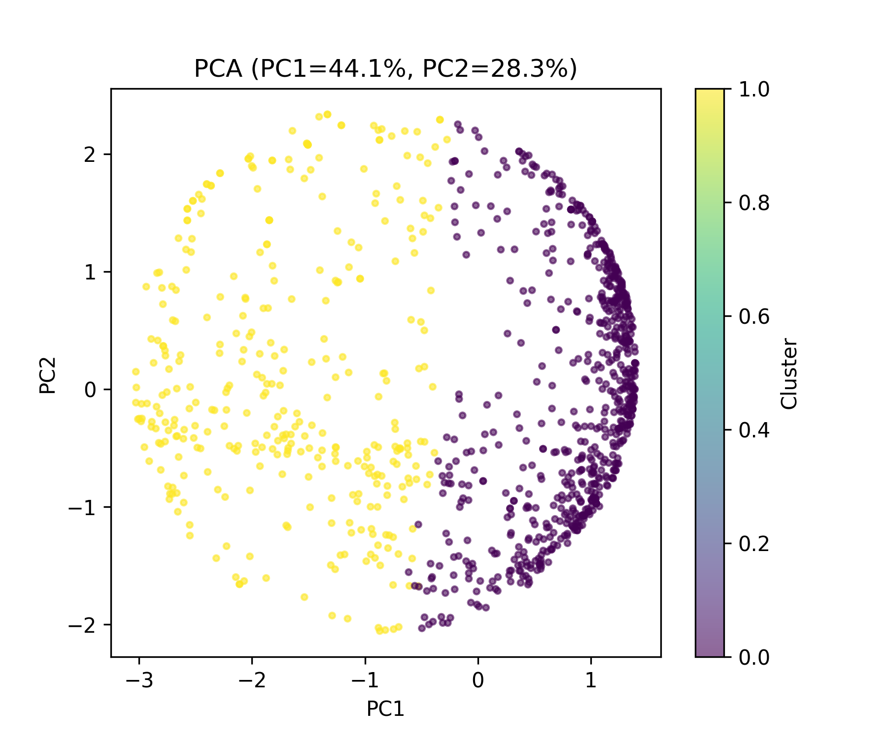
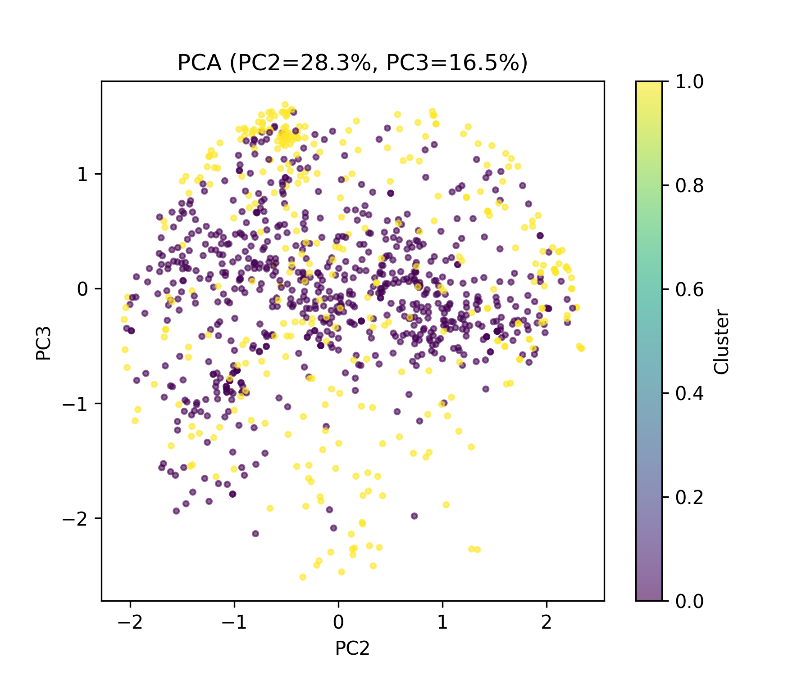
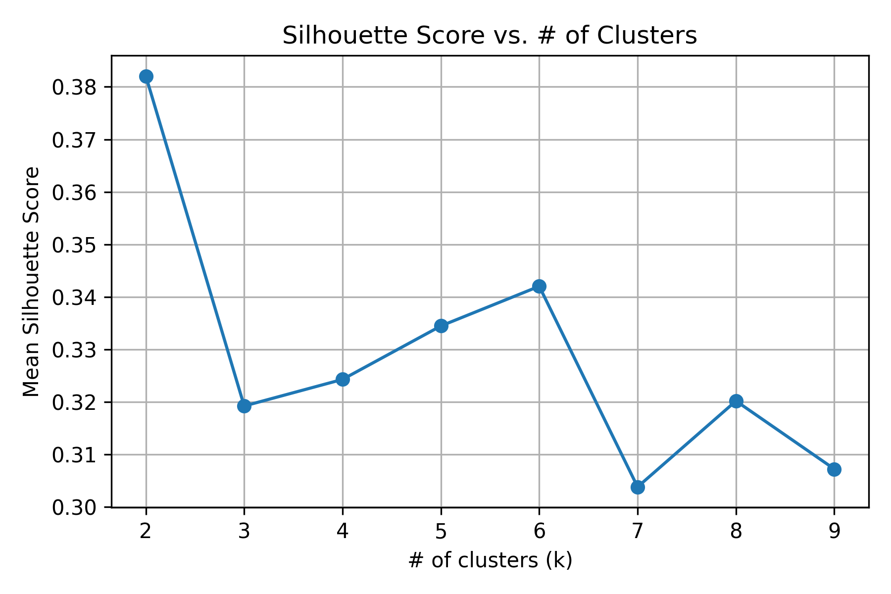
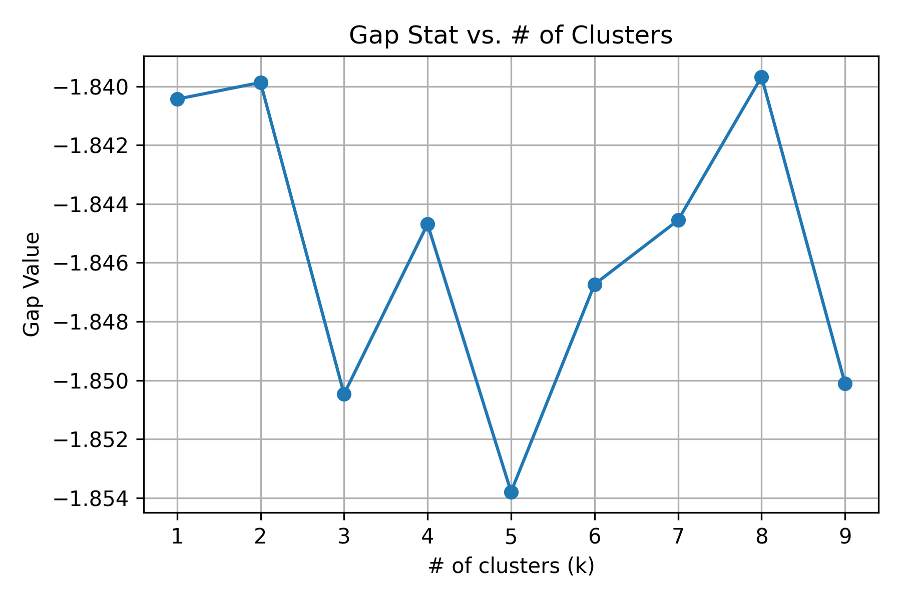
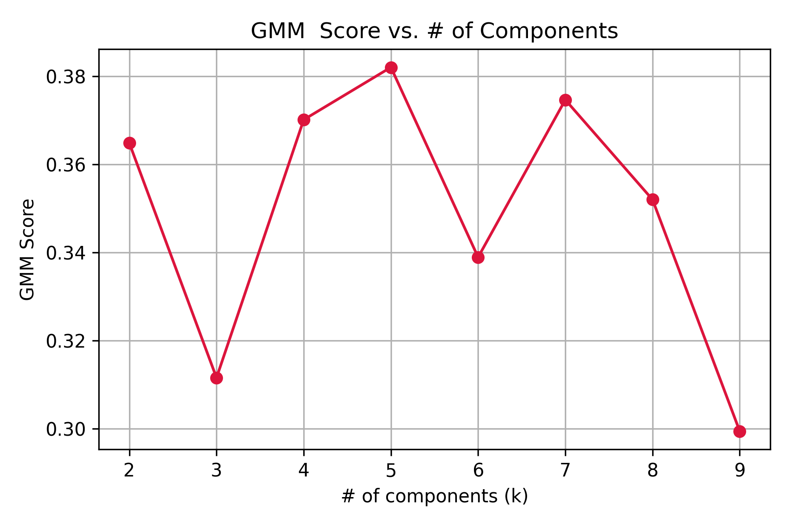
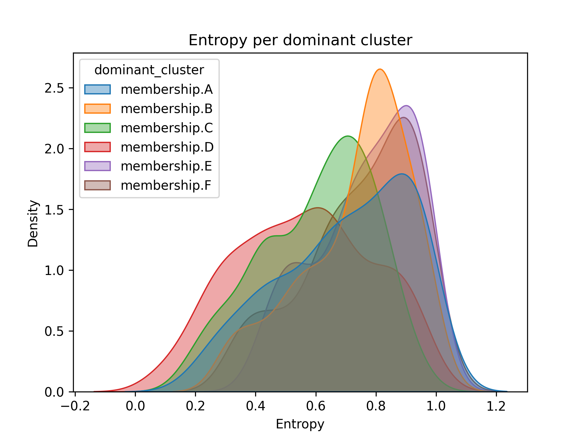

# Mini Analysis of (EGF-Induced) Phosphorylation Dynamics

**Based on data from Olsen et al. (Cell, 2006)**

## Table of Contents

- [Background](#background)
- [Biological Context](#biological-context)
- [Quantitative Measurements](#quantitative-measurements)
- [Methodology](#methodology)
- [Dataset Overview](#dataset-overview)
  - [Table S2 — Raw Quantitative Data](#table-s2---raw-quantitative-data)
  - [Table S6 — Processed and Statistically Significant Data](#table-s6---processed-and-statistically-significant-data)
- [Interpretation](#interpretation)
- [Environment](#environment)
- [What This Repository Does](#what-this-repository-does)
- [Files](#files)
- [Outputs](#outputs)
- [Discussion of Results](#discussion-of-results)
- [Work In Progress](#in-progress)
- [Future Work](#future-work)
- [Citation](#citation)

## Background

The goal of Olsen et al. (2006) was to map phosphorylation signaling dynamics following epidermal growth factor (EGF) stimulation. Phosphorylation is a key regulatory event — EGFR activation triggers cascades across hundreds of downstream proteins.

Mass spectrometry (MS) was used to track intensity of phosphopeptides at multiple timepoints after stimulation. Peptides were mapped using Mascot search results.

## Biological Context

- Each phosphopeptide = fragment of a parent protein
- Network includes:
  - Kinases / phosphatases
  - Adapters
  - Cytoskeletal components
  - Nuclear regulators

Phosphorylation is **site-specific**, and different sites on the same protein can behave independently.

Example: **EGFR Y1173**

## Quantitative Measurements

SILAC ratios at each timepoint relative to 0 min:

- Ratio > 1 → increased phosphorylation
- Ratio < 1 → decreased phosphorylation

## Methodology

Stable Isotope Labeling by Amino Acids in Cell Culture (SILAC):

- Light vs. Heavy amino acid cell states
- Co-analyzed by MS
- **Heavy/Light ratio** used to quantify phosphosite changes

Supporting metrics:

- **Localization probability** (phosphate site confidence)
- **Mascot score** (peptide identification confidence)

## Dataset Overview

### Table S2 — Raw Quantitative Data

- Thousands of phosphosites
- Unfiltered intensity + SILAC ratios
- Subcellular fraction annotations

### Table S6 — Processed and High-Confidence Data

Filtered for:

- Localization probability > 0.75–0.90
- Reproducibility & consistent kinetic pattern
- pY (tyrosine) enrichment

## Interpretation

Table S6 captures the most meaningful phosphorylation behaviors ranging from:

- **Early transient activation**
- **Sustained signaling**
- **Delayed responses**
- **Negative/feedback regulation**

## Environment

- Python 3.14
- Jupyter Notebook / VS Code
- Libraries:
  - pandas, numpy
  - matplotlib, seaborn
  - scikit-learn
  - hdbscan
  - scipy / statsmodels

## What This Repository Does

This analysis has expanded significantly:

1. Loads and cleans phosphosite time-course data
2. Z-score normalization per peptide (temporal shape only)
3. Dimensionality reduction:

- PCA variance structure

4. Multiple clustering algorithms:

- **K-Means** (k = 2-3 tested)
- **Gaussian Mixture Model (GMM)** → soft membership probabilities
- **HDBSCAN** → density clusters + biologically-relevant outliers

5. Cluster validation:

- Silhouette Score
- Gap Statistic

6. **New biological insight approaches**

- Membership entropy → quantifies “cross-pathway” ambiguity
- ANOVA comparing entropy across dominant clusters

## Files

- main.ipynb
- OlsenData_TableS6.csv
- Results/ # all exported plots

## Outputs

### K-Means: K = 3

#### Average EGF Response

There are three clusters that represent three unique groups of phosphosites that display similar behavior over time.
Clusters 0 and 1 show variable phosphorylation, whereas cluster 2 suggests that its constituents are consistently
phosphorylated over the time period.

#### PCA1 vs PCA2

The first two principal components capture 44.1% and 28.3% of the variance in the data respectively, and
72.4% total. The remaning components, 3 through 5, represent 16.49, 11.16, and 2.96e-06 percent of the data respectively.

#### PCA2 vs PCA 3

Principle component 3 captures 16.5% of the variance in the data.

### K-Means: K = 2

#### Average EGF Response

Clusters 0 and 1 show varying, opposing phosphorylation patterns. This is consistent with a k of 3, but not quite as robust, as the third cluster
shows a relevant phosphrylation pattern.

<!-- #### PCA1 vs PCA2

#### PCA2 vs PCA3

 -->

The plot above supports the earlier conclusion that a k of 3 is the most robust.

### Model Validation

Dispersion:

_Dispersion plot here._

<!--

Silhouette Score:

Silhouette scores compare the intra cluster distances with the distances between clusters to minimize overlap and provide the k value
at which this is accomplished. A higher score represents better clustering.

Gap Statistic:

- K=2 → best Silhouette
- K≈8 → best Gap → indicates hierarchical signaling waves
- K = 8 may represent overfitting.

---

### Gaussian Mixture Model (GMM)

Soft membership assignments:

---

### HDBSCAN

Density-based cluster detection + outliers:

--- -->

### Fuzzy Entropy / Ambiguity Analysis

Entropy quantifies the "shared" vs "distinct" roles, separating those that are involved in multiple pathways and thsoe that act mostly in a single pathway.

- _Low entropy_ → pathway-specific signaling nodes
- _High entropy_ → multi-complex adaptor proteins (biologically interesting)

## Discussion

- **2 dominant signaling states** explain most variance
- But deeper analysis reveals **sub-structure**: multiple biological waves
- HDBSCAN highlights sparsely activated phosphosites → potential rare regulators
- Entropy analysis reveals **hub-like proteins bridging pathways**

This aligns with known EGF signaling behavior:

- EGFR tyrosines: early rapid spikes
- MAPK axis + cytoskeleton: intermediate phase
- Nuclear phosphoproteins: sustained late responses

## In Progress

- Show that high entropy sites correspond to known hub proteins
- Show that low entropy sites correspond to known pathway specific proteins
- Compare entropy based method against hierarchical and correlation based methodds
- Quantify the differences in performance

## Future Work

- Implement dispersion metric for clustering
- Map the pS/T by ID and cluster to visualize and for use in next steps
- Mapping phosphosites to known signaling pathways
- Identifying kinase-substrate relationships using NetworkKIN / PhosphositePlus
- Annotating clusters with protein function, domain context, and disease relevance
- Evaluating EGFR downstream signaling roles
- tracing cytoskeletal adaptors vs nuclear feedback proteins

## Citation

Olsen, J. V., Blagoev, B., Gnad, F., Macek, B., Kumar, C., Mortensen, P., & Mann, M. (2006).
_Global, in vivo, and site-specific phosphorylation dynamics in signaling networks._
Cell, 127(3), 635–648. https://doi.org/10.1016/j.cell.2006.09.026
