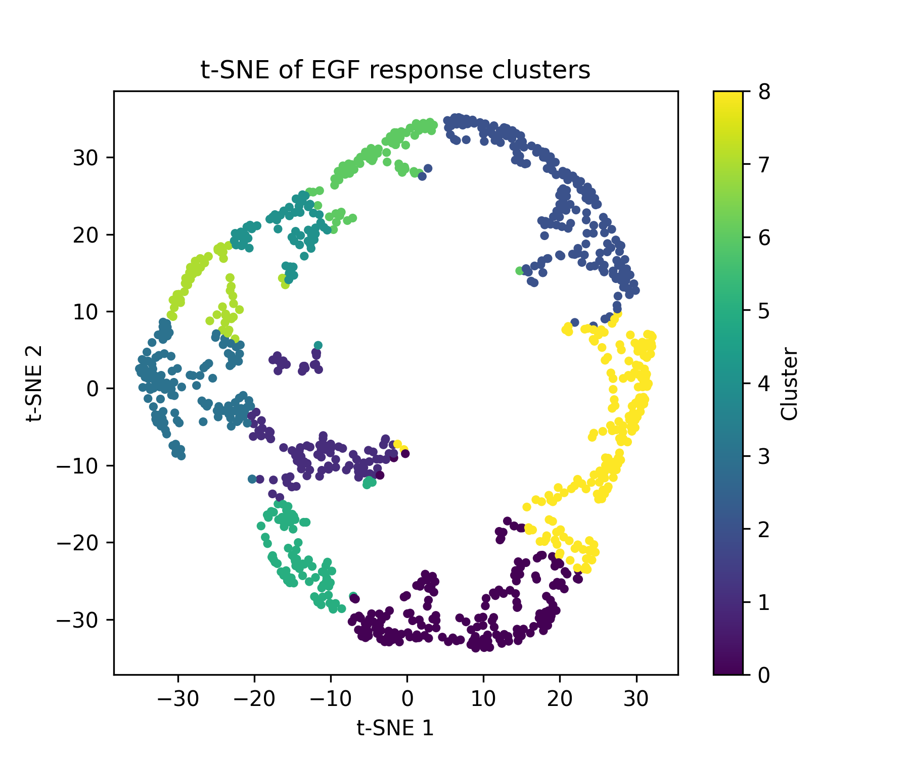

# Mini Analysis of (EGF-Induced) Phosphorylation Dynamics

**Based on data from Olsen et al. (Cell, 2006)**

## Table of Contents

- [Background](#background)
- [Biological Context](#biological-context)
- [Quantitative Measurements](#quantitative-measurements)
- [Methodology](#methodology)
- [Dataset Overview](#dataset-overview)
  - [Table S2 — Raw Quantitative Data](#table-s2---raw-quantitative-data)
  - [Table S6 — Processed and Statistically Significant Data](#table-s6---processed-and-statistically-significant-data)
- [Interpretation](#interpretation)
- [Environment](#environment)
- [What This Repository Does](#what-this-repository-does)
- [Files](#files)
- [Outputs](#outputs)
- [Discussion of Results](#discussion-of-results)
- [Citation](#citation)

## Background

The goal of Olsen et al. (2006) was to map phosphorylation signaling dynamics in human cells following epidermal growth factor (EGF) simulation. Phosphorylation is a key regulatory even in signaling - EGF activates a receptor tyrosine kinase (EGFR), which triggers cascades of phosphorylation across hundreds of downstream proteins.

Using quantitative mass spectromoy, amino acid residues that become phosphorylated over time after EGF stimulation were tracked.

Each peptide spectrum was matched to known protein sequences using the Mascot search engine. This produced thousands of phosphopeptides (pp), which are peptide fragments that each contain at least one phosphorylated amino acid.

## Biological Context

- Each phosphopeptide corresponds to a fragment of a parent protein.
- The dataset includes ~2,000 proteins, collectively forming a cellular phosphorylation signaling network that involves:
  - Kinases
  - Phosphatases
  - Adapters
  - Cytoskeletal proteins
  - And other signaling components

A phosphosite refers to the exact residue on a protein that carries the phosphate group. For example:
EGFR Y1173 represents a tyrosine residue at position 1173 on EGFR

Different sites on the same protein can have distinct or even opposing functions, making exact site identification critical.

## Quantitative Measurements

Phosphorylation dynamis were measured as ratios, wher the relative abundance of each pp at a given time point was compared to a control time, time 0.

For example: A ratio of. at 5 minutes means phosphorylation increased 3-fold compared to the baseline.

## Methodology

Ratios were obtained using Stable Isotope Labeling by Amino acids in Cell culture.

- One cell population was grown in light amino acids
- another cell population was grown in heavy isotopic amino acids
- After EGF stimulation, mass spectrometry detected both populations
- The ratio of heavy/light indicated a fold change in phosporylation

The mass spectrometry intensity represents the raw mass spectrometry signal for a peptide proportional to abundance.

Localization probability represents the statistical confience that the phosphate is truly located at that residue, calculated using Ascore.

THe mascot score is the confidence that the peptide sequence itself is correctly matched.

## Dataset Overview

### Table S2 - Raw Quantitative Data

This table contains the following:

- Raw phosphopeptide intensities and SILAC ratios across the EGF stimulation time course
- Each row represents a unique phosphosite
- Columns include:
  - Protein accession ID
  - Site position by start/stop Amino Acid
  - Designation of cytoplasmic or nuclear fraction
  - Time point ratios

### Table S6 - Processed and Statistically Significant Data

This is a filtered subset of S2 containing pps that meet the criteria of:

- High localization probability as defined by the range >0.75-0.9
- Consistent kinetic pattern across replicates
- Reproducible ratios
- pY enriched peptides since EGF signaling is tyrosine kinase driven

Each peptide entry includes:

- Designation of cytoplasmic or nuclear fraction
- Start and stop amino acid positions
- Time course columns

## Interpretation

Beause Table S6 contains pps that passed localization and reproducibility standards, it represents the most biologically meaningful subset of the experiment.

THe datasat captures dynamic phopsphorylation responses across the EGF network, revealing patterns of:

- Early, transient activation that may represent receptor autophosphorylation
- Delayed signaling responses
- Sustained or feedback-modulated phospho events

## Environment

- Python version 3.14
- Visual Studio Code Editor
- Libraries: pandas, numpy, matplotlib, scikit-learn

## What THis Repository Does

- Loads Table S6
- Normalizes phosphopeptide signals in the form of by z scores per peptide across time
- Performes dimensionality reduction
- Clusters peptides using K means with a k value of 3
- Visualizes PCA variance, cluster separation using t-SNE, and average phosphorylation dynamics per cluster

## Files

main.py

- Main analysis script

OlsenData_TableS6.csv

- Processed phosphopeptide data

results/

- Output folder for PCA, t-SNE, and time course plots

## Outputs

pca_variance.png

- 2D PCA showing structure

tsne_clusters.png

- t-SNE embedded with K means color labels

mean_timecourses.png

- Cluster averaged temporal phosphorylation patterns

## Discussion of Results

### K = 3

Plotting of the clustered EGF Response produced three dynamic motifs.

- Cluster 0 (Blue): Displays a gradual, sustained increase.
- Cluster 1 (Orange): Displays a transient early peak followed by strong repression.
- Cluster 2 (Green): Displays biphasic behavior. An early rise is observed, following a dip, then reactivation.

Clusters 1 and 2 appear to be modeling opposing kinase/phosphatase behavior.

After PCA was performed, 72% of the variance was captured in two components.

tSNE colored by cluster displays separation via three arc like clusters.

## Citations

Olsen, J. V., Blagoev, B., Gnad, F., Macek, B., Kumar, C., Mortensen, P., & Mann, M. (2006). Global, in vivo, and site-specific phosphorylation dynamics in signaling networks. Cell, 127(3), 635–648. https://doi.org/10.1016/j.cell.2006.09.026
