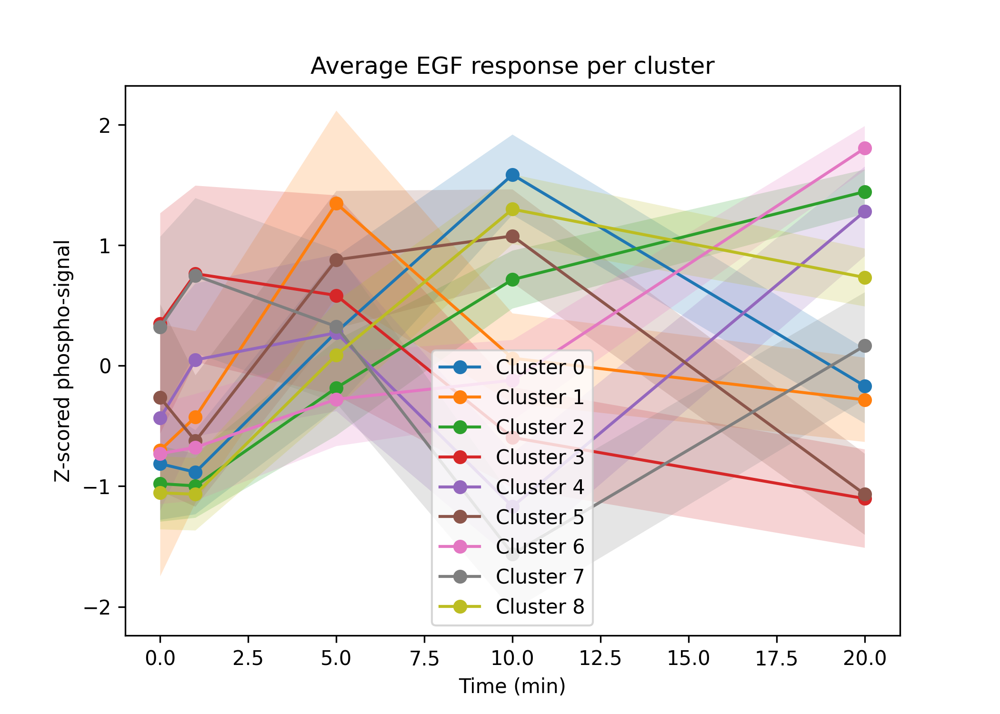
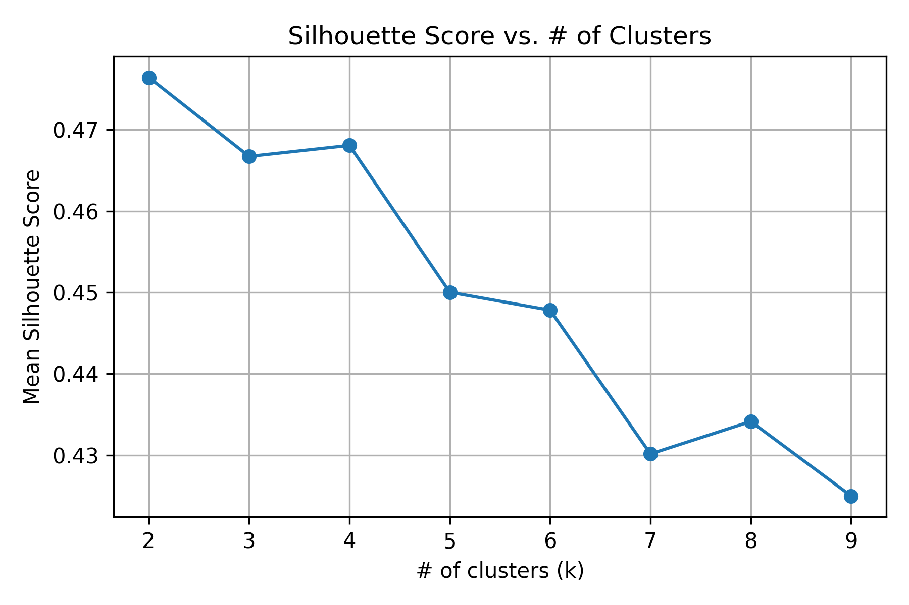
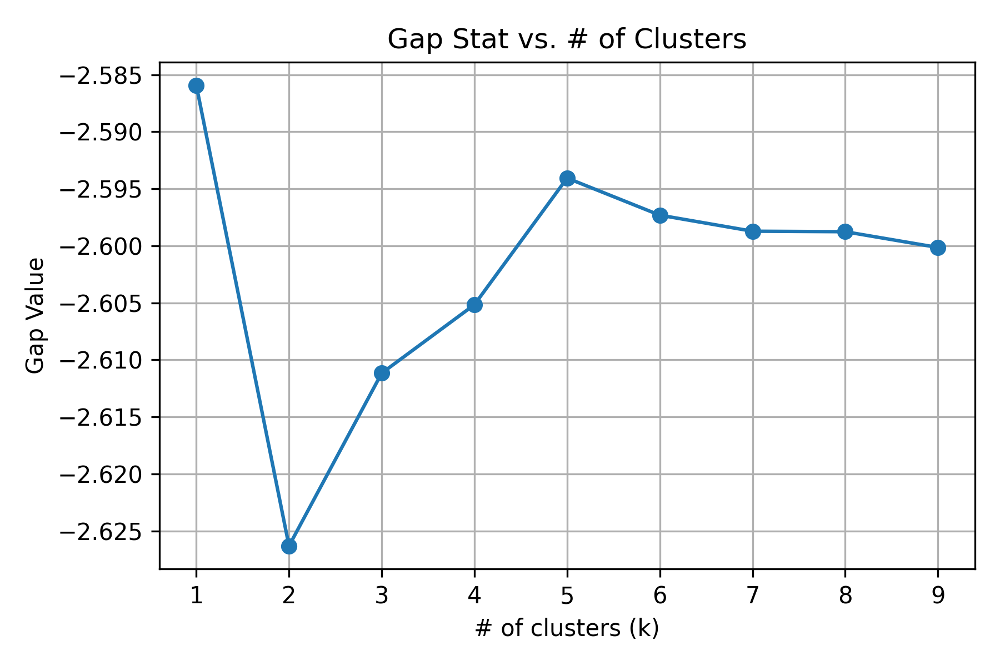
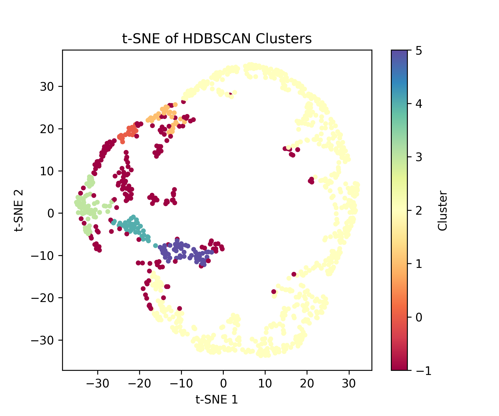

markdown

# Mini Analysis of (EGF-Induced) Phosphorylation Dynamics

**Based on data from Olsen et al. (Cell, 2006)**

## Table of Contents

- [Background](#background)
- [Biological Context](#biological-context)
- [Quantitative Measurements](#quantitative-measurements)
- [Methodology](#methodology)
- [Dataset Overview](#dataset-overview)
  - [Table S2 — Raw Quantitative Data](#table-s2---raw-quantitative-data)
  - [Table S6 — Processed and Statistically Significant Data](#table-s6---processed-and-statistically-significant-data)
- [Interpretation](#interpretation)
- [Environment](#environment)
- [What This Repository Does](#what-this-repository-does)
- [Files](#files)
- [Outputs](#outputs)
- [Discussion of Results](#discussion-of-results)
- [Citation](#citation)

## Background

The goal of Olsen et al. (2006) was to map phosphorylation signaling dynamics following epidermal growth factor (EGF) stimulation. Phosphorylation is a key regulatory event — EGFR activation triggers cascades across hundreds of downstream proteins.

Mass spectrometry was used to track abundance of phosphopeptides at multiple timepoints post-stimulation. Peptides were mapped using Mascot search results.

## Biological Context

- Each phosphopeptide = fragment of a parent protein
- Network includes:
  - Kinases / phosphatases
  - Adapters
  - Cytoskeletal components
  - Nuclear regulators

Phosphorylation is **site-specific**, and different sites on the same protein can behave independently.

Example: **EGFR Y1173**

## Quantitative Measurements

SILAC ratios at each timepoint relative to 0 min:

- Ratio > 1 → increased phosphorylation
- Ratio < 1 → decreased phosphorylation

## Methodology

Stable Isotope Labeling by Amino Acids in Cell Culture (SILAC):

- Light vs. Heavy amino acid cell states
- Co-analyzed by MS
- **Heavy/Light ratio** used to quantify phosphosite changes

Supporting metrics:

- **Localization probability** (phosphate site confidence)
- **Mascot score** (peptide identification confidence)

## Dataset Overview

### Table S2 — Raw Quantitative Data

- Thousands of phosphosites
- Unfiltered intensity + SILAC ratios
- Subcellular fraction annotations

### Table S6 — Processed and High-Confidence Data

Filtered for:

- Localization probability > 0.75–0.90
- Reproducibility & consistent kinetic pattern
- pY (tyrosine) enrichment

## Interpretation

Table S6 captures the most meaningful phosphorylation behaviors ranging from:

- **Early transient activation**
- **Sustained signaling**
- **Delayed responses**
- **Negative/feedback regulation**

## Environment

- Python 3.14
- Jupyter Notebook / VS Code
- Libraries:
  - pandas, numpy
  - matplotlib, seaborn
  - scikit-learn
  - hdbscan
  - scipy / statsmodels

## What This Repository Does

This analysis has expanded significantly:

✅ Loads and cleans phosphosite time-course data  
✅ Z-score normalization per peptide (temporal shape only)  
✅ Dimensionality reduction:

- PCA variance structure
- t-SNE visualization

✅ Multiple clustering algorithms:

- **K-Means** (k = 2–4 tested)
- **Gaussian Mixture Model (GMM)** → soft membership probabilities
- **HDBSCAN** → density clusters + biologically-relevant outliers

✅ Cluster validation:

- Silhouette Score
- Gap Statistic

✅ **New biological insight approaches**

- Membership entropy → quantifies “cross-pathway” ambiguity
- ANOVA comparing entropy across dominant clusters

## Files

main.ipynb
OlsenData_TableS6.csv
Results/ # all exported plots

## Outputs

### K-Means: K = 3

### K-Means: K = 2

---

### Model Validation

Silhouette Score:

Gap Statistic:

_Note:_
K=2 → best Silhouette
K≈8 → best Gap
→ indicates hierarchical signaling waves

---

### Gaussian Mixture Model (GMM)

Soft membership assignments:

---

### HDBSCAN

Density-based cluster detection + outliers:

---

### Fuzzy Entropy / Ambiguity Analysis

Quantifies “shared” vs “distinct” signaling roles:

_Low entropy_ → pathway-specific signaling nodes
_High entropy_ → multi-complex adaptor proteins (biologically interesting)

## Discussion of Results

- **2 dominant signaling states** explain most variance
- But deeper analysis reveals **sub-structure** — multiple biological waves
- HDBSCAN highlights sparsely activated phosphosites → potential rare regulators
- Entropy analysis reveals **hub-like proteins bridging pathways**

This aligns with known EGF signaling behavior:

- EGFR tyrosines: early rapid spikes
- MAPK axis + cytoskeleton: intermediate phase
- Nuclear phosphoproteins: sustained late responses

## Citation

Olsen, J. V., Blagoev, B., Gnad, F., Macek, B., Kumar, C., Mortensen, P., & Mann, M. (2006).
_Global, in vivo, and site-specific phosphorylation dynamics in signaling networks._
Cell, 127(3), 635–648. https://doi.org/10.1016/j.cell.2006.09.026
